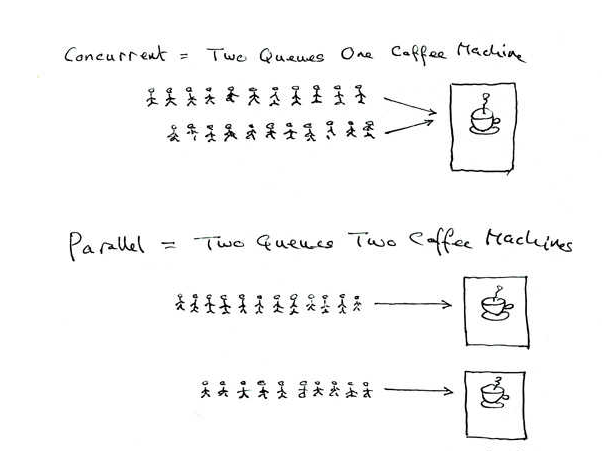
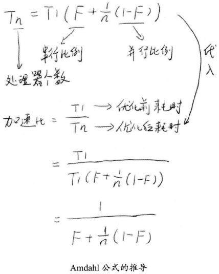
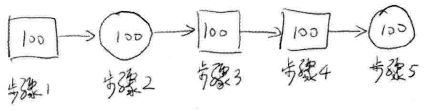
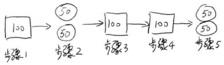
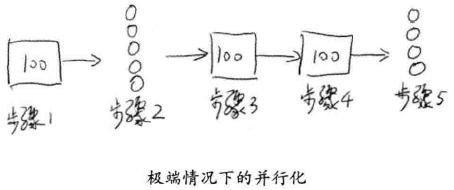
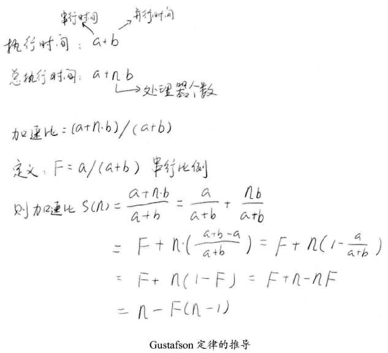

# 走进并行世界 #

[1.何去何从的并行计算](#何去何从的并行计算)

[1.1.忘掉那该死的并行](#忘掉那该死的并行)

[1.2.可怕的现实：摩尔定律的失效](#可怕的现实摩尔定律的失效)

[1.3.柳暗花明：不断地前进](#柳暗花明不断地前进)

[1.4.光明或是黑暗](#光明或是黑暗)

[2.你必须知道的几个概念](#你必须知道的几个概念)

[2.1.同步和异步](#同步和异步)

[2.2.并发和并行](#并发和并行)

[2.3.临界区](#临界区)

[2.4.阻塞和非阻塞](#阻塞和非阻塞)

[2.5.死锁、饥饿和活锁](#死锁饥饿和活锁)

[3.并发级别](#并发级别)

[3.1.阻塞](#阻塞)

[3.2.无饥饿](#无饥饿)

[3.3.无障碍](#无障碍)

[3.4.无锁](#无锁)

[3.5.无等待](#无等待)

[4.有关并行的两个重要定律](#有关并行的两个重要定律)

[4.1.Amdahl定律](#amdahl定律)

[4.2.Gustafson定律](#gustafson定律)

[4.3.Amdahl定律和Gustafson定律是否相互矛盾](#amdahl定律和gustafson定律是否相互矛盾)

[5.回到Java：Java Memory Model](#回到javajavamemorymodel)

[5.1.原子性Atomicity](#原子性atomicity)

[5.2.可见性Visibility](#可见性visibility)

[5.3.有序性Ordering](#有序性ordering)

[5.4.Happen-Before规则](#happenbefore规则)

## 何去何从的并行计算 ##

### 忘掉那该死的并行 ###

Linus Torvalds认为并行计算只有在图像处理和服务端编程2个领域可以使用。

### 可怕的现实：摩尔定律的失效 ###

### 柳暗花明：不断地前进 ###

### 光明或是黑暗 ###

## 你必须知道的几个概念 ##

### 同步和异步 ###

同步(Synchronous)和异步(Asynchronous)通常用来形容一次方法调用。

- 同步方法调用一旦开始，调用者必须等到方法调用返回后，才能继续后续的行为。
- 异步方法调用更像一个消息传递，一旦开始，方法调用就会立即返回，调用者就可以继续后续的操作。而，异步方法通常会在另外一个线程中，“真实”地执行着。整个过程，不会阻碍调用者的工作。

---

打个比方，比如我们去购物，如果你去商场实体店买一台空调，当你到了商场看中了一款空调，你就想售货员下单。售货员去仓库帮你调配物品。这天你热的实在不行了。就催着商家赶紧给你配送，于是你就等在商场里，候着他们，直到商家把你和空调一起送回家，一次愉快的购物就结束了。这就是**同步调用**。

不过，如果我们赶时髦，就坐再家里打开电脑，在网上订购了一台空调。当你完成网上支付的时候，对你来说购物过程已经结束了。虽然空调还没有送到家，但是你的任务都已经完成了。商家接到你的订单后，就会加紧安排送货，当然这一切已经跟你无关了，你已经支付完成，想什么就能去干什么了，出去溜达几圈都不成问题。等送货上门的时候，接到商家电话，回家一趟签收即可。这就是**异步调用**。

### 并发和并行 ###

并发(Concurrency)和并行(Parallelism)是两个非常容易被混淆的概念，它们**都可以表示两个或多个任务一起执行**，但是偏重点有些不同。**并发**偏重于多个任务交替执行，而多个任务之间有可能还是串行的。而**并行**是真正意义上的 “**同时执行**” 。

严格意义上来说，并行的多个任务是真实的同时执行，而对于并发来说，这个过程只是交替的，一会儿运行任务A，一会儿执行任务B，系统会不停地在两者间切换。但对于外部观察者来说，即使多个任务之间是串行并发的，也会造成多任务间是并行执行的错觉。

如果系统内只有一个 CPU，而使用多进程或多线程任务，那么真实环境中不可能真实并行的，毕竟一个 CPU 一次只能执行一条指令，这种情况下多进程或多线程就是**并发**，而不是**并行**。真实的并行也只可能出现在拥有多个 CPU 的系统中（如多核 CPU）。

### 临界区 ###

Critical Section

**临界区**用来表示一种公共资源或者说是共享资源，可以被多个线程使用。**但是每一次，只能有一个线程使用它，一旦临界区资源被占用**，其他线程要想使用这个资源，就必须等待。

比如，在一个办公室里有一台打印机，打印机一次只能执行一个任务。如果小王和小明同时需要打印文件，很显然，如果小王先下发了打印任务，打印机就开始打印小王的文件了，小明的任务就只能等待小王打印结束后才能打印，这里的打印机就是一个临界区的例子。

在并行程序中，临界区资源是保护的对象，如果意外出现打印机同时执行两个打印任务，那么最可能的结果就是打印出来的文件就会是损坏的文件，它既不是小王想要的，也不是小明想要的。

### 阻塞和非阻塞 ###

Blocking and Non-Blocking

阻塞和非阻塞通常用来形容多线程间的相互影响。比如一个线程占用了临界区资源，那么其他所有需要这个而资源的线程就必须在这个临界区中进行等待。等待会导致线程挂起，这种情况就是**阻塞**。此时，如果占用资源的线程一直不愿意释放资源，那么其他所有阻塞在这个临界区上的线程都不能工作。

**非阻塞**的意思与之相反，它强调没有一个线程可以妨碍其他线程执行。所有的线程都会尝试不断前向执行。

### 死锁、饥饿和活锁 ###

死锁（Deadlock）、饥饿（Starvation）和活锁（Livelock）都属于多线程的活跃性问题。

- **死锁**应该是最糟糕的一种情况了，它表示两个或者两个以上的进程在执行过程中，由于竞争资源或者由于彼此通信而造成的一种阻塞的现象，若无外力作用，它们都将无法推进下去。此时称系统处于死锁状态或系统产生了死锁，这些永远在互相等待的进程称为死锁进程。

- **饥饿**是指某一个或者多个线程因为种种原因无法获得所需要的资源，导致一直无法执行。比如：

	- 它的线程优先级可能太低，而高优先级的线程不断抢占它需要的资源，导致低优先级的线程无法工作。在自然界中，母鸡喂食雏鸟时，很容易出现这种情况，由于雏鸟很多，食物有限，雏鸟之间的食物竞争可能非常厉害，小雏鸟因为经常抢不到食物，有可能会被饿死。线程的饥饿也非常类似这种情况。
	- 另外一种可能是，某一个线程一直占着关键资源不放，导致其他需要这个资源的线程无法正常执行，这种情况也是饥饿的一种。

- **活锁**。举个例子，当你要坐电梯下楼，电梯到了，门开了，这时你正准备出去，但不巧的是，门外一个人挡着你的去路，他想进来。于是你很绅士的靠左走，避让对方，但同时对方也很绅士，但他靠右走希望避让你。结果，你们又撞上了。于是乎，你们都意识到了问题，希望尽快避让对方，你立即向右走，他也立即向左走，结果又撞上了！不过介于人类的只能，我相信这个动作重复 2、 3 次后，你应该可以顺利解决这个问题，因为这个时候，大家都会本能的对视，进行交流，保证这种情况不再发生。**但**如果这种情况发生在两个线程间可能就不会那么幸运了，如果线程的智力不够，且都秉承着 “谦让” 的原则，主动将资源释放给他人使用，那么就会出现资源不断在两个线程中跳动，而没有一个线程可以同时拿到所有的资源而正常执行。这种情况就是活锁。

## 并发级别 ##

由于临界区的存在，多线程之间的并发必须受到控制，根据并发的策略大致将并发的级别进行分为

1. 阻塞
2. 无饥饿
3. 无障碍
4. 无锁
5. 无等待

### 阻塞 ###

阻塞（Blocking）

一个线程是阻塞的那么在其他线程释放资源前，当前线程无法继续执行。当使用synchonized关键字或者重入锁时，得到的就是阻塞的线程。

无论是synchonized关键字或者重入锁都会试图在执行后续代码前得到临界区的锁，如果得不到则会挂起等待，直到占有了所需要的资源为止。

### 无饥饿 ###

无饥饿（Starvation-Free）

如果线程之间是有优先级的，那么线程调度的时候总是会倾向于满足高优先级的线程。也就是说，对于同一个资源的分配，是不公平的。

锁也分公平锁和非公平锁，对于**非公平锁**来说，系统允许高优先级的线程插队。这样就有可能导致低优先级的线程产生饥饿。

但是如果是**公平锁**，满足先来后到，那么饥饿就不会产生，不管新来的线程优先级多高，要想获得资源，就必须乖乖排队。这样所有的线程都有机会执行。

### 无障碍 ###

无障碍（Obstruction-Free）

无障碍是一种最弱的非阻塞调度。两个线程如果是无障碍的执行，那么他们不会因为临界区的问题导致一方被挂起。换言之，**大家都可以大摇大摆的进入临界区了**。那么如果大家一起修改共享区数据，把数据修改坏了怎么办呢？对于无障碍的线程来说，一旦检测到这种情况，它就会立即对自己所做的修改进行回滚，确保数据安全。但是如果没有数据竞争发生，那么线程就可以顺利完成自己的工作，走出临界区。

如果说阻塞的控制方式是**悲观策略**。也就是说，系统认为两个线程之间很有可能发生不幸的冲突，因此，以保护共享数据为第一优先级。相对来说，非阻塞的调度就是一种**乐观策略**，它认为多个线程之间很有可能不会发生冲突，或者说这种概率不大。因此大家都应该无障碍的执行，但是一旦检测到冲突，就应该进行回滚。

从这个策略可以看出，无障碍的多线程程序不一定能顺畅的运行。因为当临界区中存在严重的冲突时，所有的线程可能都会不断的回滚自己的操作，导致没有一个线程能顺利走出临界区。这种情况会影响系统的正常执行。所以，可能会非常希望在这一堆线程中，至少可以有一个线程能够在有限的时间内完成自己的操作，而退出临界区。至少这样可以保证系统不会在临界区中进行无限的等待。

一种可行的无障碍实现可以依赖一个“一致性标记”来实现：线程在操作之前，先读取并保存这个标记，在操作完成之后，再次读取，检查这个标记是否更改过，如果两者是一致的，则说明资源访问没有冲突。如果不一致，则说明资源可能在操作过程中与其他线程存在冲突，需要重新操作。而任何对资源有修改操作的线程，在修改数据前，都需要更新这个一致性的标记，表示数据不再安全。

### 无锁 ###

无锁（Lock-Free）

无锁的并行都是无障碍的。在无锁的情况下，所有的线程都能尝试对临界区进行访问，但不同的是，**无锁的并发保证必然有一个线程能够在有限步内完成操作走出临界区**。

在无锁的调用中，一个典型的特点是可能会包含一个无线循环。在这个循环中，线程会不断尝试修改共享变量，如果没有冲突，修改成功，那么程序退出。否则继续尝试修改，但无论如何，无锁的并行总能保证一个线程胜出，不会全军覆没。至于临界区中竞争失败的线程，它们则必须不断重试，直到自己获胜，如果运气不好，总是不成功，则会出现饥饿的现象，线程会停止不前。

	while (!atomicVar.compareAndSet(localVar, localVar+1)) 
	{ 
	    localVar = atomicVar.get(); 
	}

### 无等待 ###

无等待（Wait-Free）

无锁只要求一个线程可以在有限步数内完成操作，而无等待则是在无锁的基础上更进一步进行扩展，**它要求所有的线程都必须在有限步数内完成**，这样就不会引起线程饥饿问题。

一种典型的无等待结构是RCU（Read-Copy-Update）。它的基本思想是，对数据的读可以不加控制。因此，所有的读操作是无等待的，他们既不会被锁定等待也不会引起任何冲突。但是在写数据的时候，先取得原始数据的副本，接着只修改副本数据（这就是为什么读可不加控制），修改完成后，在合适的时机回写数据。

## 有关并行的两个重要定律 ##

并发主要出于两个目的。

1. 为了获得更好的性能；
2. 由于业务模型的需要，确实需要多个执行实体。

关于性能问题，从串行程序改为并发，一般来说可以提供程序的整体的性能，但是究竟能提高多少。

用两个定律可以回答

### Amdahl定律 ###

Amdahl定律是计算机科学中非常重要的定律，它定义了串行系统并行化后加速比的计算公式和理论上限。

**加速比定义：加速比=优化前系统耗时/优化后系统耗时**

所谓加速比，就是优化前的耗时与优化后耗时的比值。加速比越高，表明优化效果越明显。

下图显示了Amdahl公式的推导过程，其中n表示处理器个数，T表示时间，T1表示优化前耗时（也就是只有1个处理器时的耗时），Tn表示使用n个处理器优化后的耗时。F是程序中只能串行执行的比例。

根据这个公式，如果CPU处理器数量趋于无穷，那么加速比与系统的串行化率成反比，如果系统中必须有50%的代码串行执行，那么系统的最大加速比为2。

假设有一程序分为以下步骤执行，每个执行步骤花费100个时间单位。其中，只有步骤2和步骤5可以进行并行，步骤1、3、4必须串行，如下图所示。在全串行的情况下，系统合计耗时500个时间单位。

若将步骤2和步骤5并行化，假设在双核处理上，则有如下图所示的处理流程。在这种情况下，步骤2和步骤5的耗时将为50个是单位。故系统整体耗时为400个时间单位。根据加速比的定义有：

**加速比=优化前系统耗时/优化后系统耗时=500/400=1.25**

或者前文中给出的加速比公式。由于5个步骤中，3个步骤必须串行，因此其串行化比重为3/5=0.6，即F=0.6，且双核处理器的处理器个数N为2。代入公式得：

**加速比=1/(0.6+(1-0.6)/2)=1.25**

---

在极端情况下，假设并行处理器个数为无穷大，则有如图下所示的处理过程。步骤2和步骤5的处理时间趋于0。即使这样，系统整体耗时依然大于300个时间单位。即加速比的极限为500/300=1.67。

使用加速比计算公式，N趋于无穷大，有Speedup=1/F，且F=0.6，故有Speedup=1.67。

**由此可见**，为了提高系统的速度，仅增加CPU处理器的数量并不一定能起到有效的作用，需要从根本上修改程序的串行行为，提高系统内可并行化的模块比重，在此基础上，合理增加并行处理器数量，才能以最小的投入，得到最大的加速比。

>注意：根据Amdahl定律，使用多核CPU对系统进行优化，优化的效果取决于CPU的数量以及系统中的串行化程序的比重。CPU数量越多，串行化比重越低，则优化效果越好。仅提高CPU数量而不降低程序的串行化比重，也无法提高系统性能。

### Gustafson定律 ###

Gustafson定律也试图说明处理器个数、串行比例和加速比之间的关系，如下图所示，但是Gustafson定律和Amdahl定律的角度不同。同样，加速比都定义为优化前的系统耗时除以优化后的系统耗时。

可以看到，由于切入角度的不同，Gustafson定律的公式和Amdahl定律的公式截然不同。从Gustafson定律中，我们可以更容易地发现，如果串行化比例很小，并行化比例很大，那么加速比就是处理器的个数。**只要你不断地累加处理器，就能获得更快的速度。**

### Amdahl定律和Gustafson定律是否相互矛盾 ###

Amdahl定律强调：当串行比例一定时，加速比是有上限的，不管你堆叠多少个CPU参与计算，都不能突破这个上限。

Gustafson定律关心的是：如果可被并行化的代码所占比重足够多，那么加速比就能随着CPU的数量线性增长。

## 回到Java：Java Memory Model ##

JMM关键技术点都是围绕多线程的原子性、可见性和有序性。

### 原子性Atomicity ###

指一个操作是不可中断的。即使是在多个线程一起执行的时候，一个操作一旦开始，就不会被其他线程干扰。

[MultiThreadLong](MultiThreadLong.java)

### 可见性Visibility ###

指当一个线程修改了某个一个共享变量的值，其他线程是否能够立即知道这个修改。

### 有序性Ordering ###

为了流水线有较大吞吐量，指令重排。

但重排后，程序运行结果可能会出意外。

### Happen-Before规则 ###

- 程序顺序规则：一个线程中的每个操作，happens-before于该线程中的任意后续操作。
- 监视器锁规则：对一个锁的解锁，happens-before于随后对这个锁的加锁。
- volatile变量规则：对一个volatile域的写，happens-before于任意后续对这个volatile域的读。
- 传递性：如果A happens-before B，且B happens-before C，那么A happens-before C。
- start()规则：如果线程A执行操作ThreadB.start()（启动线程B），那么A线程的ThreadB.start()操作happens-before于线程B中的任意操作。
- join()规则：如果线程A执行操作ThreadB.join()并成功返回，那么线程B中的任意操作happens-before于线程A从ThreadB.join()操作成功返回。
- 程序中断规则：对线程interrupted()方法的调用先行于被中断线程的代码检测到中断时间的发生。
- 对象finalize规则：一个对象的初始化完成（构造函数执行结束）先行于发生它的finalize()方法的开始。

