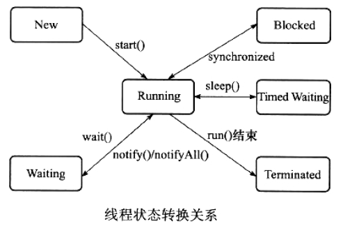
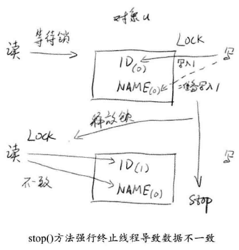
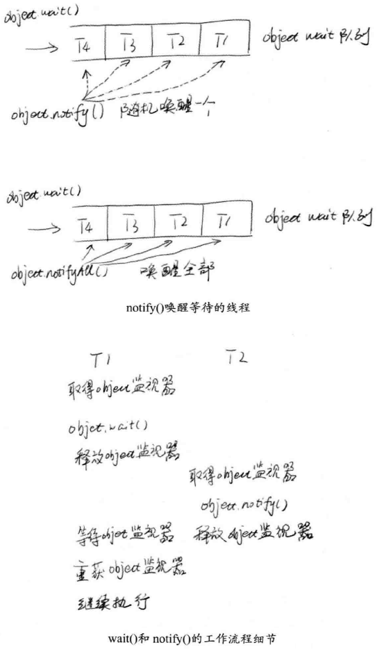
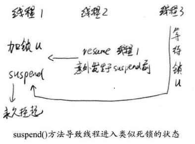

# Java并行程序基础 #

## 线程需知 ##

进程是由 **程序代码**和**其相关联的数据集**（内有：标识符、状态、优先级等） 两个基本原素组成的实体。假设处理器开始执行这个程序代码，这个执行实体称为进程。

[《操作系统——精髓与设计原理 7th》](#)

线程就是轻量级进程，是程序执行的最小单位。

使用多线程而不是用多进程并发程序的设计，是因为线程间的切换和调度的成本远远小于进程的。

---

Java语言定义了5种线程状态，在任意一个时间点，一个线程只能有且只有其中的一种状态，这5种状态分别如下：

- 新建（New）：创建后尚未启动的线程处于这种状态。

- 运行（Runable）：Runable包括了操作系统线程状态中的Running和Ready，也就是处于此状态的线程有可能正在执行，也有可能正在等待着CPU为它分配执行时间。

- 无限期等待（Waiting）：处于这种状态的线程不会被分配CPU执行时间，它们要等待被其它线程显示地唤醒。以下方法会让线程陷入无限期的等待状态：

	- 没有设置Timeout参数的Object.wait()方法
	- 没有设置Timeout参数的Thread.join()方法
	- LockSupport.park()方法

- 限期等待（Timed Waiting）：处于这种状态的线程也不会被分配CPU执行时间，不过无须等待被其它线程显示地唤醒，在一定时间之后它们会由系统自动唤醒。以下方法会让线程进入限期等待状态：

	- Thread.sleep()方法
	- 设置了Timeout参数的Object.wait()方法
	- 设置了Timeout参数的Thread.join()方法
	- LockSupport.parkNanos()方法
	- LockSupport.parkUntil()方法

- 阻塞（Blocked）：线程被阻塞了，“阻塞状态”与“等待状态”的区别是：“阻塞状态”在等待着获取到一个排它锁，这个事件将在另外一个线程放弃这个锁的时候发生；而“等待状态”则是在等待一段时间，或者唤醒动作的发生。在程序等待进入同步区域的时候，线程将进入这种状态。

- 结束（Terminated）：已终止线程的线程状态，线程已经结束执行。

上述5种状态在遇到特定事件发生的时候将会互相转换，它们的转换关系如下图：

[《深入理解JVM》](#)

## 初始线程：线程的基本操作 ##

### 新建线程 ###

	Thread t1 = new Thread();
	t1.start()

Thread中有run方法，**不要run()来开启新线程中**，它串行执行run()中的代码。

若要Thread跑任务，须重写run() 或 用实现Runnable接口构造Thread

	Thread t1 = new Thread(){
		@Override
		public void run(){
			System.out.println("Hello");
		}
	};
	t1.start();

or

	//这方法常用，考虑到Java是单继承的
	Thread t1 = new Thread(new Runnable(){
		@Override
		public void run(){
			System.out.println("Hello");
		}
	});
	t1.start();

[CreateThread](CreateThread.java)

### 终止线程 ###

#### 被遗弃的stop()的自白 ####

我太过粗暴，强行把执行到一半的线程终止，可能会引起一些**数据不一致**的问题。

[StopThreadUnsafe](StopThreadUnsafe.java)

stop()已被标除废除方法。

#### 标志终止 ####

终止线程的一种方法，只需定义一个**标记变量**，由我们自行决定线程何时退出就可以了。

[StopThread](StopThread.java)

### 线程中断 ###

线程中断并不会使线程立即退出，而是给线程发送一个通知，告知目标线程，有人希望你退出啦！

至于目标线程接到通知后如何处理，则完全由目标线程自行决定。**这点重要**，若中断后，线程立即无条件退出，会遇到stop()方法的老问题。

同线程中断相关的方法

	void interrupt()//通知目标线程中断，也就是设置中断标志位。
	boolean isInterrupted//判断线程是否中断
	static boolean interrupted()//判断线程是否中断，并清除当前中断状态
	
若要线程中断后退出，就必须为它增加响应的中断处理代码。否则，通知目标线程中断注定徒劳。

[StopThreadWithInterrupt](StopThreadWithInterrupt.java)

与标志终止类似，但中断功能比标志终止更强劲。

当线程在sleep()休眠时，如果被中断，这个异常就会产生。

**注意**，Thread.sleep()方法由于中断而抛出异常，此时，它会清除中断标记，若不加处理，那么在下一次循环开始时，就无法捕获这个中断，故在异常处理（catch语块）中，再次设置中断标记位。

若捕获中断，可立即退出线程。或者保证数据的一致性和完整性，再退出。

### 等待wait和通知notify ###

**wait()和notify()工作过程**

若一线程调用object.wait()，那么它就会进入object对象的等待队列。在这个等待队列中，可能会有多个线程，因为系统运行多个线程同时等待某一个对象。

当object.notify()被调用时，它就会从这个等待队列中，随机选择一个线程，并将其唤醒。

---

notifyAll()唤醒等待队列中**所有**等待线程。

[Java: notify() vs. notifyAll() all over again它两区别](https://stackoverflow.com/questions/37026/java-notify-vs-notifyall-all-over-again)

---

wait()和notify()**必须**包含在对应的synchronized语句中，无论是wait()或者notify都需要首先获得目标对象的一个监视器。

[wait()和notify()例程](SimpleWN.java)

**注意**：Object.wait()和Thread.sleep()方法都可以让线程等待若干个时间。除了wait()可以被唤醒外，另外一个主要区别就是wait()方法**会释放目标对象的锁**，而Thread.sleep()方法**不会释放任何资源**。

### 挂起suspend和继续执行resume线程 ###

这两方法同样标注为**废除方法**。

不推荐使用suspend()去挂起线程的原因，是因为suspend()在导致线程暂停的同时，并**不会去释放任何锁资源**。此时，其它任何线程想要访问被它暂用的锁时，都会被牵连，导致无法正常继续运行。直到对应的线程上进行了resume()操作，被挂起的线程才能继续，从而其它所有阻塞在相关锁上的线程也可以继续执行。

---

**但是**，若resume()操作意外地在suspend()前就执行了，那么被挂起的线程可能很难有机会被继续执行。

并且，**更严重的是**：它所占用的锁不会被释放，因此可能会导致这个系统工作不正常。而且，对于被挂起的线程，从它的线程状态上看，仍然是Runnable，这也会严重影响我们队系统当前状态的判断。

[BadSuspend](BadSuspend.java)

[改用wait()和notify()修改BadSuspend](GoodSuspend.java)

### 等待线程结束join和谦让yield ###

[join() API](https://docs.oracle.com/javase/7/docs/api/java/lang/Thread.html) Waits for this thread to die.

This implementation uses a loop of `this.wait` calls conditioned on `this.isAlive`. As a thread terminates the `this.notifyAll` method is invoked. It is **recommended** that applications not use `wait`, `notify`, or `notifyAll` on Thread instances.

[JoinMain](JoinMain.java)

---

[yield() API](https://docs.oracle.com/javase/7/docs/api/java/lang/Thread.html) A hint to the scheduler that the current thread is willing to yield its current use of a processor. The scheduler is free to ignore this hint.

Yield is a heuristic启发式的 attempt to improve relative progression between threads that would otherwise over-utilise a CPU. Its use should be combined with detailed profiling and benchmarking to ensure that it actually has the desired effect.

**It is rarely appropriate to use this method.** It may be useful for debugging or testing purposes, where it may help to reproduce bugs due to race conditions. It may also be useful when designing concurrency control constructs such as the ones in the [java.util.concurrent.locks](https://docs.oracle.com/javase/7/docs/api/java/util/concurrent/locks/package-summary.html) package.

Thread.yield()的调用就好像在说：我已经完成一些最重要的工作了，我应该休息了，可以给其他线程一些工作机会。

## volatile与Java内存模型JMM ##

