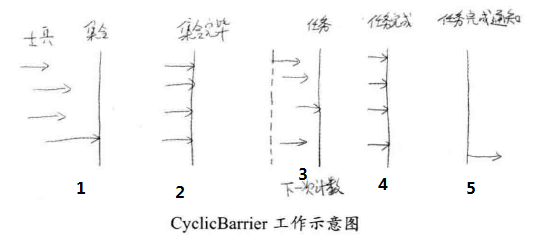
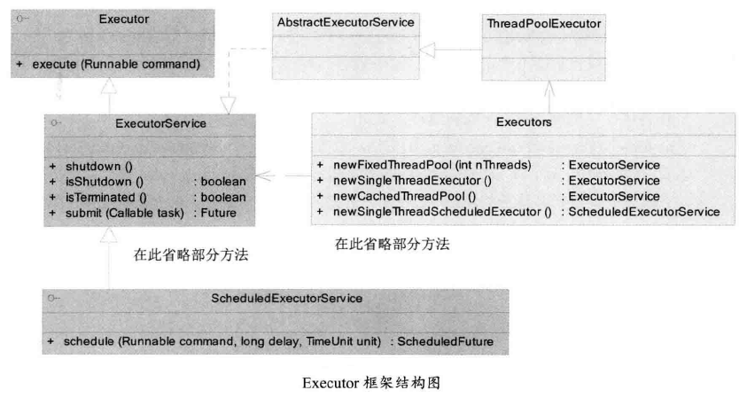

# JDK并发包 #

## 多线程团队协作：同步控制 ##

### synchronized的功能扩展：重入锁 ###

重入锁可完全替代synchronized关键字。在JDK5的早期版本中，重入锁的性能远远好于synchronized，但从JDK6开始，JDK在synchronized上做了大量的优化，使得两者的性能差距并不大。

[重入锁实现两线程对i进行累加](ReenterLock.java)

重入锁ReentrantLock的名字有重入的原因：**该锁可以反复进入**。

    lock.lock();
    lock.lock();
    try {
        i++;
    } finally {
        lock.unlock();
		lock.unlock();
    }

上述代码中，一个线程连续两次获得同一把锁。

若不允许这么操作，那么同一个线程在第2次获得锁时，将会和自己产生死锁。程序就会“卡死”在第2次申请锁的过程中。

但需要注意的是，**若同一个线程多次获得锁，那么在释放锁的时候，也必须释放相同次数**。若释放锁的次数多，那么会得到一个`java.lang.IllegalMonitorStateException`，反之，若释放锁的次数少了，那么相当于线程还持有这个锁，因此，其他线程也无法进入临界区。

重入锁另外的功能：

- 中断响应
- 锁申请等待限时
- 公平锁

#### 中断响应 ####

若一线程正等待锁，那么它依然可以收到一个通知，被告知无须再等待，可停止工作了。这种情况对于处理死锁是有一定帮助的。

[IntLock](IntLock.java)

#### 锁申请等待限时 ####

tryLock()

这是避免死锁的另一种方法

[带参tryLock()的例程](TimeLock.java)

[无参tryLock()的例程](TryLock.java)

#### 公平锁 ####

	//默认不公平锁
	public ReentrantLock()
	
	//fair = true时，表示锁公平。否则，不公平。
	public ReentrantLock(boolean fair)

[FairLock](FairLock.java)

#### 重入锁小结 ####

ReentrantLock重要方法：

- lock() 获得锁，若锁已经被占用，则等待
- lockInterruptibly() 获得锁，但优先响应中断
- tryLock() 尝试获得锁，若成功，返回true，失败返回false。该方法不等待，立即返回
- tryLock(long time, TimeUnit unit) 给定时间内尝试获得锁
- unlock() 释放锁

---

重入锁的实现来看，它主要集中在Java层面，它主要包含三个要素

1. 原子状态 原子状态使用CAS操作来存储当前锁的状态，判断锁是否已经被别的线程持有。
2. 等待队列 所有没有请求到锁的线程，会进入等待队列进行等待。带有线程释放锁后，系统就能从等待队列中唤醒一个线程，继续工作。
3. 阻塞原语park()和unpark()，用来挂起和恢复线程。

### 重入锁的好搭档：Condition条件 ###

Condition与wait()和notify()方法的作用是大致相同。

但是wait()和notify()方法是和synchronized关键字合作使用的，而Condition是与重入锁相关联的。

	public interface Condition {
		void await() throws InterruptedException;
		void awaitUninterruptibly();
		long awaitNanos(long nanosTimeout) throws InterruptedException;
		boolean await(long time, TimeUnit unit) throws InterruptedException;
		boolean awaitUntil(Date deadline) throws InterruptedException;
		void signal();
		void signalAll();
	}

- await()会**使当前线程等待**，同时释放当前锁，当其他线程中使用signal()或者signalAll()方法时，线程会重新获得锁并继续执行。或者当线程被中断时，也能跳出等待。这和Object.wait()相似
- awaitUninterruptibly() 与await()方法基本相同，但是它并**不会**在等待过程中响应中断
- signal() 用于**唤醒一个在等待中的线程**。相应的signalAll()方法会唤醒所有在等待中的线程。这与Object.notify()方法很类似。

[ReenterLockCondition](ReenterLockCondition.java)

---

在JDK内部，重入锁和Condition对象被广泛地使用，以ArrayBlockingQueue为例

    /** Main lock guarding all access */
    final ReentrantLock lock;

    /** Condition for waiting takes */
    private final Condition notEmpty;

    /** Condition for waiting puts */
    private final Condition notFull;

	//...

    public void put(E e) throws InterruptedException {
        checkNotNull(e);
        final ReentrantLock lock = this.lock;
        lock.lockInterruptibly();
        try {
            while (count == items.length)
                notFull.await();//<-----------------------
            enqueue(e);
        } finally {
            lock.unlock();
        }
    }

    private void enqueue(E x) {
        // assert lock.getHoldCount() == 1;
        // assert items[putIndex] == null;
        final Object[] items = this.items;
        items[putIndex] = x;
        if (++putIndex == items.length)
            putIndex = 0;
        count++;
        notEmpty.signal();//<-----------------------
    }

相对应的take()方法如下：

    public E take() throws InterruptedException {
        final ReentrantLock lock = this.lock;
        lock.lockInterruptibly();
        try {
            while (count == 0)
                notEmpty.await();//<-----------------------
            return dequeue();
        } finally {
            lock.unlock();
        }
    }

    private E dequeue() {
        // assert lock.getHoldCount() == 1;
        // assert items[takeIndex] != null;
        final Object[] items = this.items;
        @SuppressWarnings("unchecked")
        E x = (E) items[takeIndex];
        items[takeIndex] = null;
        if (++takeIndex == items.length)
            takeIndex = 0;
        count--;
        if (itrs != null)
            itrs.elementDequeued();
        notFull.signal();//<-----------------------
        return x;
    }

上述源码来自JDK8

### 允许多个线程同时访问：信号量（Semaphore） ###

>semaphore/ˈseməfɔːr/ || /send 么 for/ n.信号标;旗语 v.打旗语;(用其他类似的信号系统)发信号

广义上说，信号量是对锁的扩展。无论是内部锁synchronized还是重入锁ReentrantLock，一次都只允许一个线程访问一个资源，而信号量却可以指定多个线程，同时访问某一个资源。

[SemapDemo](SemapDemo.java)

### ReadWriteLock读写锁 ###

ReadWriteLock是JDK5提供的读写分离锁。读写分离锁可以有效地帮助减少锁竞争，以提升系统性能。

读写锁允许多个线程同时**读**。

读写锁的访问约束情况

-|读|写
---|---|---
读|非阻塞|阻塞
写|阻塞|阻塞

[ReadWriteLockDemo](ReadWriteLockDemo.java)

上述程序体现了ReadWriteLock在多读少写情况下的优越性。

若使用普通的重入锁代替 读写锁。那么所有的读和写线程之间都必须相互等待，因此这个程序的执行时间将长达20秒。

### 倒计时器：CountDownLatch ###

>latch/lætʃ/ n.门闩;插销;碰锁;弹簧锁 v.用插销插上;用碰锁锁上

CountDownLatch的含义是，把门锁起来，不让里面的线程跑出来。因此，这个工具通常用来控制线程等待，它可以让某一线程等待直到倒计时结束，再开始执行。

对于倒计时器，一种典型的场景就是火箭发射。在火箭发射前，为了保证万无一失，往往还要进行各项设备、仪器的检查。只有等所有的检查完毕后，引擎才能点火。这种场景就非常适合使用CountdOWNlATCH。它可以使得**点火线程**等待所有检查线程全部完工后，再执行。

[CountDownLatchDemo](CountDownLatchDemo.java)

### 循环栅栏：CyclicBarrier ###

和CountDownLatch非常类似，它也可以实现线程间的计数等待。这里栅栏

CyclicBarrier可以理解为**循环栅栏**。**栅栏**就是用来阻止线程继续执行，要求线程在栅栏处等待。**循环**是指这个计数器可以反复使用。

使用场景：排长下达命令，要求10个士兵一起去完成一项任务。这时，就会要求10个士兵先集合报道，接着去执行任务。当10个士兵把自己手头的任务都执行完成。排长就宣布：“活干完了，去吃饭啰”。

[CyclicBarrierDemo](CyclicBarrierDemo.java)

cyclicBarrier.await()可能会抛出两个异常InterruptedException, BrokenBarrierException

### 线程阻塞工具类：LockSupport ###

它可在线程内任意位置让线程阻塞。和Thread.suspend()相比，它弥补了由于resume()在前发生，导致线程无法继续执行的情况。和Object.wait()相比，它不需先获得某个对象的锁，也不会抛出InterruptedException。

LockSupport的静态方法park()可以阻塞当前线程，类似的还有parkNanos()，parkUntil()等方法。它们实现了一个限时的等待。

[suspend()永久卡死线程换成LockSupport——LockSupportDemo](LockSupportDemo.java)

因为LockSupport类使用类似信号量的机制。它为每一个线程准备了一个许可，若许可可用，那么park()函数会立即返回，并且消费这个许可（也就是将许可变为不可用），如果许可不可用，就会阻塞。而unpack()则使得一个许可变为可用（但是和信号量不同的是，**许可不能累加**，你不可能拥有超过一个许可，它永远只有一个）。

这个特点使得：即使unpark()操作发生在park()之前，它也可以使下一次park()操作立即返回。上述代码可顺利结束的主要原因。

---

除了有定时阻塞的功能外，LockSupport.park()还能支持中断影响。但是和其他接受中断的函数很不一样，LockSupport.park()不会抛出InterruptException。**它只是会默默地返回**，但是可以从Thread.interrupted()等获得中断标记。

[LockSupportIntDemo](LockSupportIntDemo.java)

## 线程复用：线程池 ##

为了避免系统频繁地创建和销毁线程造成的性能损耗，可让创建的线程进行复用。

### 不要重复发明轮子：JDK对线程池的支持 ###

五种常用的静态工厂方法

- newFixedThreadPool()
- newSingleThreadExecutor()
- newCachedThreadPool()
- newSingleThreadScheduledExecutor()
- newScheduledThreadPool()

#### 固定大小的线程池 ####

[ThreadPoolDemo](ThreadPoolDemo.java)

#### 计划任务 ####

    public ScheduledFuture<?> schedule(Runnable command,
                                       long delay, TimeUnit unit);

    public ScheduledFuture<?> scheduleAtFixedRate(Runnable command,
                                                  long initialDelay,
                                                  long period,
                                                  TimeUnit unit);

    public ScheduledFuture<?> scheduleWithFixedDelay(Runnable command,
                                                     long initialDelay,
                                                     long delay,
                                                     TimeUnit unit);

**schedule方法**

Creates and executes a one-shot action that becomes enabled after the given delay.

---

**scheduleAtFixedRate方法**

Creates and executes a periodic action that becomes enabled first after **the given initial delay**, and subsequently with **the given period**; that is executions will commence开始发生 after **initialDelay** then initialDelay+period, then initialDelay + 2 * period, and so on. 

If any execution of the task encounters an exception, subsequent executions are suppressed. 

Otherwise, the task will only terminate via cancellation or termination of the executor. 

If any execution of this task takes **longer than** its period, then subsequent executions may start late, but will not concurrently execute.

---

**scheduleWithFixedDelay方法**

Creates and executes a periodic action that becomes enabled first after **the given initial delay**, and subsequently with **the given delay** between the termination of one execution and the commencement of the next. 

If any execution of the task encounters an exception, subsequent executions are suppressed. 

Otherwise, the task will only terminate via cancellation or termination of the executor.

[ScheduledExecutorServiceDemo](ScheduledExecutorServiceDemo.java)

### 刨根问底：核心线程池的内部实现 ###

    public static ExecutorService newFixedThreadPool(int nThreads) {
        return new ThreadPoolExecutor(nThreads, nThreads,
                                      0L, TimeUnit.MILLISECONDS,
                                      new LinkedBlockingQueue<Runnable>());
    }

    public static ExecutorService newSingleThreadExecutor() {
        return new FinalizableDelegatedExecutorService
            (new ThreadPoolExecutor(1, 1,
                                    0L, TimeUnit.MILLISECONDS,
                                    new LinkedBlockingQueue<Runnable>()));
    }

    public static ExecutorService newCachedThreadPool() {
        return new ThreadPoolExecutor(0, Integer.MAX_VALUE,
                                      60L, TimeUnit.SECONDS,
                                      new SynchronousQueue<Runnable>());
    }

它们多是ThreadPoolExecutor类的封装。

    public ThreadPoolExecutor(int corePoolSize,
                              int maximumPoolSize,
                              long keepAliveTime,
                              TimeUnit unit,
                              BlockingQueue<Runnable> workQueue,
                              ThreadFactory threadFactory,
                              RejectedExecutionHandler handler) {

**Parameters:**
- **corePoolSize** the number of threads to keep in the pool, even if they are idle, unless allowCoreThreadTimeOut is set
- **maximumPoolSize** the maximum number of threads to allow in the pool
- **keepAliveTime** when the number of threads is greater than the core, this is the maximum time that excess idle threads will wait for new tasks before terminating.
- **unit** the time unit for the keepAliveTime argument
- **workQueue** the queue to use for holding tasks before they are executed. This queue will hold only the Runnable tasks submitted by the execute method.
- **threadFactory** the factory to use when the executor creates a new thread
- **handler** the handler to use when execution is blocked because the thread bounds and queue capacities are reached

构造函数用到几种BlockingQueue

- 直接提交的队列 SynchronousQueue
- 有界任务队列 ArrayBlockingQueue
- 无界任务队列 LinkedBlockingQueue
- 优先任务队列 PriorityBlockingQueue

    public void execute(Runnable command) {
        if (command == null)
            throw new NullPointerException();
        int c = ctl.get();
        if (workerCountOf(c) < corePoolSize) {
            if (addWorker(command, true))
                return;
            c = ctl.get();
        }
        if (isRunning(c) && workQueue.offer(command)) {
            int recheck = ctl.get();
            if (! isRunning(recheck) && remove(command))
                reject(command);
            else if (workerCountOf(recheck) == 0)
                addWorker(null, false);
        }
        else if (!addWorker(command, false))
            reject(command);
    }

Proceed in 3 steps:

1. If fewer than corePoolSize threads are running, try to start a new thread with the given command as its first task.  The call to addWorker atomically checks runState and workerCount, and so prevents false alarms that would add threads when it shouldn't, by returning false.

2. If a task can be successfully queued, then we still need to double-check whether we should have added a thread (because existing ones died since last checking) or that the pool shut down since entry into this method. So we recheck state and if necessary roll back the enqueuing if stopped, or start a new thread if there are none.

3. If we cannot queue task, then we try to add a new thread.  If it fails, we know we are shut down or saturated and so reject the task.

### 超负载了怎么办：拒绝策略 ###

JDK内置的拒绝策略

这里用**策略模式**

- AbortPolicy
- CallerRunsPolicy
- DiscardOldestPolicy
- DiscardPolicy

通过实现RejectedExecutionHandler接口，自定义拒绝策略。

[RejectThreadPoolDemo——日志记录被拒绝的任务](RejectThreadPoolDemo.java)

### 自定义线程创建：ThreadFactory ###

线程池的线程从何而来？ThreadFactory

[ThreadFactoryDemo——将提交线程池的线程通过ThreadFactory转换成守护线程](ThreadFactoryDemo.java)

### 我的应用我做主：扩展线程池 ###

使用场景：想监控每个任务执行的开始和结束时间，或者其他一些自定义的增强功能

ThreadPoolExecutor是一个可以扩展的线程池。它提供了beforExecute()、afterExecute()、terminated()三个接口对线程池进行控制。

execute()深层内含beforExecute()、afterExecute()，这方法将会被多线程访问

这里用到**模板方法模式**

[ExtThreadPool](ExtThreadPool.java)

### 合理的选择：优化线程池线程数量 ###

《Java Concurrency in Practice》给出一个估算线程池大小的经验公式：

在Java中，可以通过：

	Runtime.getRuntime().availableProcessors()

取得可用的CPU数量

### 堆栈去哪里了：在线程池中寻找堆栈 ###

[计算两个树的商](DivTask.java)

