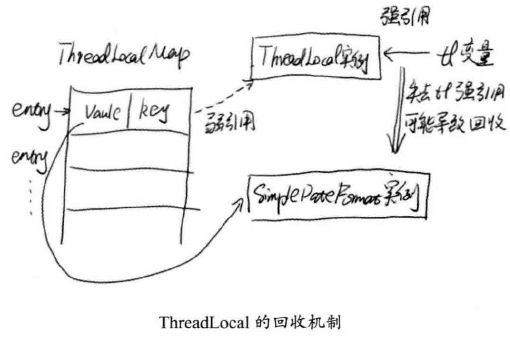

# 锁的优化及注意事项 #

## 有助于提高“锁”性能的几点建议 ##

### 减少锁持有时间 ###

	public synchronized void syncMethod(){
		othercode1();
		mutexMethod();
		othercode2();
	}

转变成

	public void syncMethod(){
		othercode1();
		synchronized(this){
			mutexMethod();
		}
		othercode2();
	}

### 减少锁粒度 ###

这种技术典型的使用场景就是ConcurrentHashMap类的实现。

对于HashMap来说，最重要的两方法get()、put()。一种最自然的想法就是对整个HashMap加锁，必然可以得到一个线程安全的对象。但是，这样做的话被认为加大锁粒度。

对于ConcurrentHashMap，它内部进一步细分了若干个小的HashMap，称之为段Segment。

如果需要在ConcurrentHashMap中增加一个新的表项，并不是件整个HashMap加锁，而是首先根据hashcode得到该表项应该被存放到哪个段中，然后对该段加锁，并完成put()操作。在多线程环境下，若多个线程同时进行put()操作，只要被加入的表项不存放在同一段中，则线程间便可以做到真正的并行。

### 读写分离锁来替换独占锁 ###

ReadWriteLock可以提高系统的性能。使用读写分离锁来替代独占锁是减少锁粒度的一种特殊情况。

### 锁分离 ###

一个典型的案例就是java.util.concurrent.LinkedBlockingQueue的实现。

它定义了takeLock和putLock，它们分别take()和put()操作中使用。因此，take()和put()就吃相互独立，它们之间不存在锁竞争关系，只需要在take()和take()、put()和put()间分别对takeLock和putLock进行竞争。从而，削弱锁竞争的可能性。

### 锁粗化 ###

VM在遇到一连串连续地对同一锁不断进行请求和释放的操作是，便会把所有的锁操作整合成对锁的一次请求，从而减少对锁的请求同步次数，这个操作叫做锁的粗化。

	public void demoMethod(){
	
		synchronized(lock){
			//do sth
		}
	
		//做其它不需要的同步工作，但能很快执行完毕
	
		synchronized(lock){
			//do sth
		}
	
	}

会被整合成

	public void demoMethod(){
	
		synchronized(lock){

			//do sth

			//做其它不需要的同步工作，但能很快执行完毕

			//do sth
		}
	
	}

---

	for(int i = 0; i < circle; i++){
		synchronized(lock){
	
		}
	}

更合理做法是在外层只请求一次锁：

	synchronized(lock){
		for(int i = 0; i < circle; i++){

		}
	}

性能优化就是根据运行时的真实情况对各种资源点进行权衡折中的过程。锁粗化的思想和减少锁持有时间是相反的，但在不同的场合，它们的效果并不相同。所以需根据实际情况，进行权衡。

## JVM对锁优化所做的努力 ##

### 锁偏向 ###

它的核心思想是：如果一个线程获得了锁，那么锁就进入**偏向模式**。当这个线程再次请求锁时，无须再做任何同步操作。这样就节省了大量有关锁申请的操作，从而提高了程序性能。

因此对于几乎没有锁竞争的场合，偏向锁有比较好的优化效果，因为连续多次极有可能是同一个线程请求相同的锁。

而对于锁竞争比较激烈的场合，其效果不佳。因为在竞争激烈的场合，最有可能的情况是每次都是不同的线程来请求相同的锁。

这样偏向模式会失效，因此还不如不启用偏向锁。使用Java虚拟机参数-XX:UseBiasedLocking

### 轻量级锁 ###

若偏向锁失败，VM并不会立即挂起线程。它会使用一种称为轻量级锁的优化手段。轻量级锁的操作也很轻便，它只是简单地将对象头部作为指针，指向持有锁的线程堆栈的内部，来判断一个线程是否持有对象锁。

若对象线程获得轻量级锁成功，则可以顺利进入临界区。

若轻量级锁加锁失败，则表示其他线程抢先争夺到锁，那当前线程的锁请求就会膨胀为重量级锁。

### 自旋锁 ###

锁膨胀后，虚拟机为了避免真实地在操作系统层面挂起，虚拟机会在最后的努力——自旋锁。由于当前线程暂时无法获得锁，但是什么时候可以获得锁时一个未知数。也许在几个CPU周期后，就可以得到锁。如果这样，简单粗暴地挂起线程可能是一种得不偿失的操作。

因此，系统会进行一次赌注：它会假设在不久的将来，线程可以得到这把锁。因此，虚拟机会让当前线程做几个空循环（这也是自旋的含义），在经过若干次循环后，如果可以得到锁，那么就顺利进入临界区。如果还不能获得锁，才会真实地将线程在操作系统层面挂起。

### 锁消除 ###

JVM在JIT编译时，通过对运行上下文的扫描，去除不可能存在共享资源竞争锁。通过锁消除，可以节省毫无意义的请求锁时间。

锁消除涉及一项关键技术为**逃逸分析**。逃逸分析就是观察某一个变量是否会逃出某一个作用域。

逃逸分析必须在-server模式下进行，可以使用-XX:+DoEscapeAnalysis参数打开逃逸分析。使用-XX:+EliminateLocks参数可以打开锁消除。

## 人手一支笔：ThreadLocal ##

### ThreadLocal的简单使用 ###

[ParseDateDemo](ParseDateDemo.java)SimpleDateFormat.parse()线程不安全例程

[ParseDateThreadLocalDemo](ParseDateThreadLocalDemo.java)SimpleDateFormat.parse()线程安全例程

### ThreadLocal实现原理 ###

    public void set(T value) {
        Thread t = Thread.currentThread();
        ThreadLocalMap map = getMap(t);//ThreadLocalMap是Thread的字域
        if (map != null)
            map.set(this, value);
        else
            createMap(t, value);
    }

    ThreadLocalMap getMap(Thread t) {
        return t.threadLocals;
    }

    public void set(T value) {
        Thread t = Thread.currentThread();
        ThreadLocalMap map = getMap(t);
        if (map != null)
            map.set(this, value);
        else
            createMap(t, value);
    }

ThreadLocalMap是Thread的字域，这意味着只要线程不退出，对象的引用一直存在。

Thread在退出时，会进行一些清理工作。

	//Thread类的方法
    private void exit() {
        if (group != null) {
            group.threadTerminated(this);
            group = null;
        }
        /* Aggressively null out all reference fields: see bug 4006245 */
        target = null;
        /* Speed the release of some of these resources */
        threadLocals = null;
        inheritableThreadLocals = null;
        inheritedAccessControlContext = null;
        blocker = null;
        uncaughtExceptionHandler = null;
    }

若使用线程池创建线程池，那就意味着当前线程未必退出。若将一些较大的对象设置到ThreadLocal中，可能会使系统出现内存泄露的可能。

及时使用ThreadLocal.remove()方法将这个变量移除，回收内存，是不错的习惯

若对于ThreadLocal的变量，手动将其设置为null，被GC容易发现，回收

[ThreadLocalDemo_GC](ThreadLocalDemo_GC.java)

>PS.JDK8运行上面例程，会运行不出书上想要的结果。

Thread.ThreadLocalMap的实现使用了**弱引用**。JVM在GC时，若发现弱引用，就会立即回收。

    static class Entry extends WeakReference<ThreadLocal<?>> {
        /** The value associated with this ThreadLocal. */
        Object value;

        Entry(ThreadLocal<?> k, Object v) {
            super(k);
            value = v;
        }
    }

### 对性能有何帮助 ###

简单测试ThreadLocal性能

[ThreadLocalDemo](ThreadLocalDemo.java)

## 无锁 ##

## 死锁 ##

## 有关死锁问题 ##

死锁就是两个或者多个线程，相互占用对方需要的资源，而都不进行释放，导致彼此之间都相互等待对方释放资源，产生了无限制等待的现象。

死锁一旦发生，若没有外力介入，这种等待将会永远存在，从而对程序产生严重的存在，从而对程序产生严重的影响。

[哲学家就餐](https://github.com/JallenKwong/ThinkingInJava/tree/master/src/main/java/com/lun/concurrency#deadlock)

[DeadLock](DeadLock.java)

运行DeadLock程序，检测**死锁**

1.jps

	Administrator@USER-20180302VA MINGW64 /c/eclipse-workspace/JavaConcurrency/src/main/java/com/lun/action/c04/image (master)
	$ jps
	4528
	5704 DeadLock
	6252 Jps

2.jstack

	Administrator@USER-20180302VA MINGW64 /c/eclipse-workspace/JavaConcurrency/src/main/java/com/lun/action/c04/image (master)
	$ jstack 5704
	2019-05-04 19:07:29
	Full thread dump Java HotSpot(TM) 64-Bit Server VM (25.161-b12 mixed mode):

	...

	JNI global references: 6
	
	
	Found one Java-level deadlock:
	=============================
	"哲学家B":
	  waiting to lock monitor 0x000000000551f348 (object 0x00000000ec73f5a8, a java.lang.Object),
	  which is held by "哲学家A"
	"哲学家A":
	  waiting to lock monitor 0x0000000006a9d8b8 (object 0x00000000ec73f5b8, a java.lang.Object),
	  which is held by "哲学家B"
	
	Java stack information for the threads listed above:
	===================================================
	"哲学家B":
	        at com.lun.action.c04.DeadLock.run(DeadLock.java:42)
	        - waiting to lock <0x00000000ec73f5a8> (a java.lang.Object)
	        - locked <0x00000000ec73f5b8> (a java.lang.Object)
	"哲学家A":
	        at com.lun.action.c04.DeadLock.run(DeadLock.java:29)
	        - waiting to lock <0x00000000ec73f5b8> (a java.lang.Object)
	        - locked <0x00000000ec73f5a8> (a java.lang.Object)
	
	Found 1 deadlock.

	

