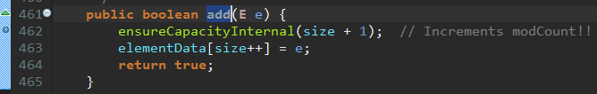
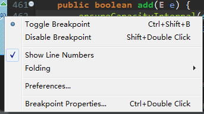

# 并行程序调试 #

[1.准备实验样本](#准备实验样本)

[2.正式起航](#正式起航)

[3.挂起整个虚拟机](#挂起整个虚拟机)

[4.调试进入ArrayList内部](#调试进入arraylist内部)

## 准备实验样本 ##

[多线程环境访问ArrayList](UnsafeArrayList.java) ArrayList线程不安全容器。

## 正式起航 ##

在ArrayList.add()函数内部设置了一个断点

调试方式启动代码

对主函数没有太大兴趣，可以为这个断点设置一些额外属性

由于我们不希望主函数启动时被中断，因此在条件断点中指定断点条件是当前线程而不是main，取得当前线程名称，并判断是否为主线程：

再次调试代码

上图可看出哪些线程

当前选中t2线程，若进行单步操作，那么t2线程就会执行，而t1不会继续执行，除非，你手工选择t1并进行相应的操作。

## 挂起整个虚拟机 ##

局部设置

全局设置

挂起虚拟机时的系统状态

当前所有线程全部处于挂起状态，不论当前线程是否接触到了断点。这种模式可以排除其他线程对被调试线程的干扰。当然，使用这种方法有时候会引起调试器或者虚拟机的一些问题，导致系统不能正常工作。

## 调试进入ArrayList内部 ##

测试代码易抛出异常

	Exception in thread "t2" Exception in thread "t1" java.lang.ArrayIndexOutOfBoundsException: 23
		at java.util.ArrayList.add(ArrayList.java:463)
		at com.lun.action.c08.UnsafeArrayList$AddTask.run(UnsafeArrayList.java:16)
		at java.lang.Thread.run(Thread.java:748)
	java.lang.ArrayIndexOutOfBoundsException: 22
		at java.util.ArrayList.add(ArrayList.java:463)
		at com.lun.action.c08.UnsafeArrayList$AddTask.run(UnsafeArrayList.java:16)
		at java.lang.Thread.run(Thread.java:748)

在ArrayList初始化时，默认会分配10个数组空间。当数组空间消耗完毕后，ArrayList就会进行自动扩容。在每次`add()`操作时，系统总要事先检查一下内部空间是否满足所需的大小，如果不满足，就会扩容，否则就可以正常添加元素。

多线程共同访问ArrayList的问题在于：在ArrayList容量快用完时（只有1个可用空间），如果两个线程同时进入`add()`函数，并同时判断认为系统满足继续添加元素而不需要扩容，进而两者都不会进行扩容操作。之后，两个线程先后向系统写入自己的数据，那么必然有一个线程会将数据写到边界外，而产生`ArrayIndexOutOfBoundsException`。

因此，设置断点如下

当ArrayList的容量为9，则触发断点，在扩容前，暂停线程。

---

1.debug后停顿如下位置

2.选择t1，step over一步

3.选择t2，step over一步

4.选择t1，step over一步

5.选择t2，step over一步

6.继续选择t2，step over一步，`ArrayIndexOutOfBoundsException`异常终于出现

